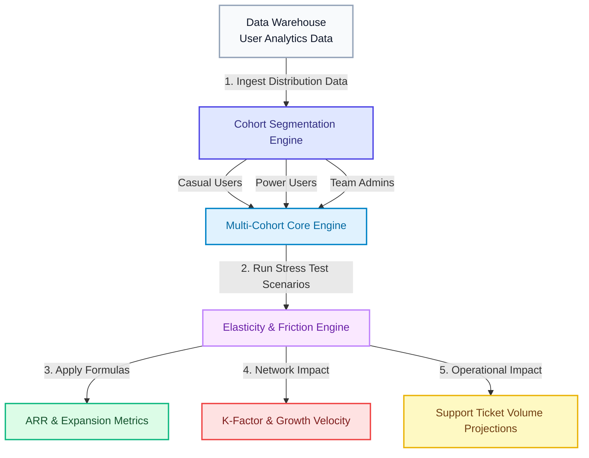

# 📊 PLG Paywall & Usage Limit Simulator

An interactive, strategic product management dashboard designed to model and balance product-led growth (PLG) conversion mechanics. This tool helps growth PMs identify the exact usage limit "sweet spot" that maximizes monthly recurring expansion revenue (ARR) without stalling organic acquisition (K-Factor) or overloading customer support operations.

### 🔗 Live Link: [View Interactive App Here](https://dhavalk21.github.io/plg-paywall-simulator/)

## 🌟 Core PM Competencies Demonstrated

* **PLG Growth Mechanics:** Deep understanding of the relationship between free usage allowances, customer friction, and organic product loops.

* **Mathematical Modeling & Forecasting:** Proves you can write and structure quantitative SaaS unit economics models instead of making ungrounded pricing assumptions.

* **Support Capacity Planning:** Factors operational risks (support ticket spikes and support overhead costs) into product launches.

* **Executive Decision Communication:** Features a built-in automated strategy brief generator that summarizes complex cohort models into plain-English executive memos ready for leadership review.

## ⚙️ How the Economics are Calculated

This simulator computes user lifecycle value and growth using industry-standard SaaS formulas:

* **User Distribution Model:** Instead of assuming all users behave the same way, the tool maps users across a real volume curve.

   Impacted Population (P_impact) = Sum of users consuming above limit L

* **Compounding Growth Impact (K-Factor):** The simulator calculates how the new limit will slow down your overall user acquisition over the next 12 months.

   K_new = K_base * (1 - Alpha * (P_impact / P_total))

  Where "K_base" is your current viral expansion rate, and "Alpha" is the friction coefficient.

* **Net Financial Impact Evaluation:**

   Net Financial Return = (New Upgrades * ARPU) - (Organic Traffic Loss * CAC) - Support Overhead

## 🎨 How it Works (System Architecture)

## 🚀 Technical Architecture

* **Responsive SVG Curve:** Live vector graph mapping the user consumption curve along a standard bell-curve distribution.

* **Dynamic Cutoff Marker:** Moving the Percentile slider automatically updates the red dashed line and the intersection indicator dot on the chart in real-time.

* **Tailwind CSS Styling:** Sleek, high-contrast white panel dashboard with full support for system viewport scaling.

* **Preset Configuration Profiles:** Includes pre-packaged options like "Balanced SaaS" and "Aggressive Paywall" to let users instantly compare different strategy models.

* **Markdown Brief Export:** High-quality strategic briefing memo generated automatically based on active simulator states.
